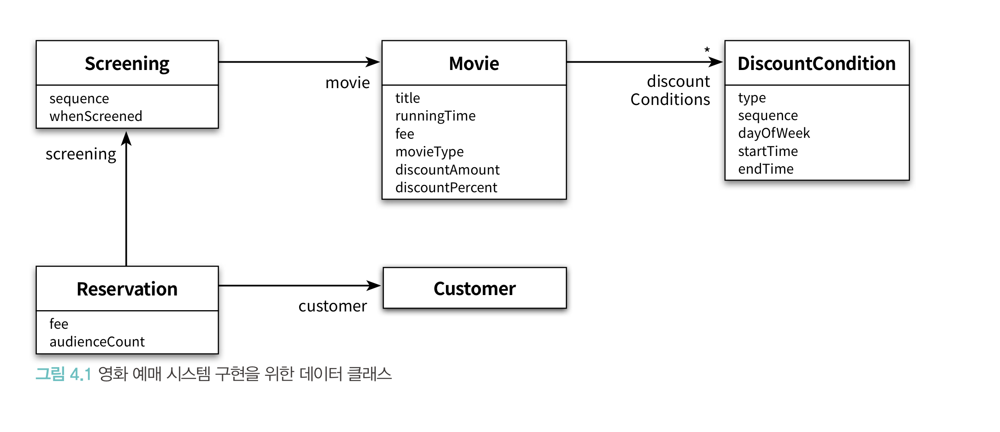
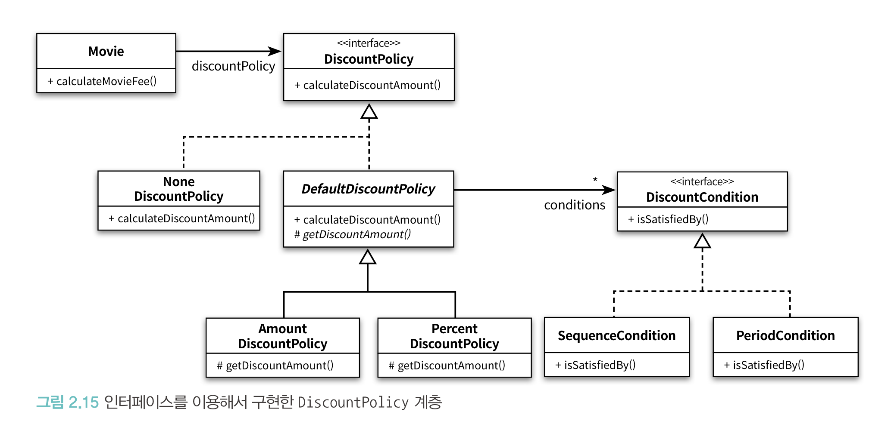
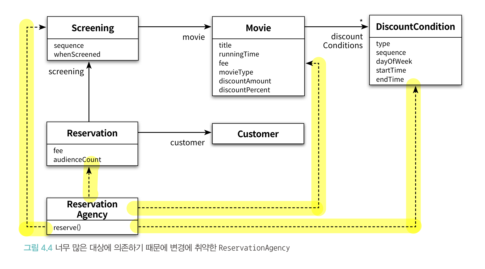

# chapter4 설계 품질과 트레이드오프

### 객체지향 설계의 핵심은 역할, 책임, 협력이다

- 협력 : `애플리케이션의 기능을 구현`하기 위해 메시지를 주고받는 객체들 사이의 `상호작용`
- 책임 : 객체가 다른 객체와 `협력`하기 위해 수행하는 `행동`
- 역할 : 대체 가능한 `책임`의 집합

<aside>
💡 객체지향 설계란 올바른 객체에게 올바른 책임을 할당하면서, `낮은 결합도`와 `높은 응집도`를 가진 구조를 창조하는 활동이다

</aside>

### 객체지향 설계에 관한 두 가지 관점

- 객체지향 설계의 핵심이 `책임`이다
- 책임을 할당하는 작업이 응집도와 결합도 같은 `설계 품질`과 깊이 연관돼 있다

### 훌륭한 설계란?

- `합리적인 비용`안에서 변경을 수용할 수 있는 구조를 만드는 것
- `합리적인 비용`은 응집도가 높고 결합도가 낮은 구조를 가진 설계에서부터 나온다 (=객체지향 설계)

### 합리적인 비용을 만드려면?

- 객체의 `상태`가 아니라 객체의 `행동`에 초점을 맞추자
- 객체의 `행동`에 초점 = 객체의 `책임`에 초점

<aside>
💡 훌륭한 설계는 합리적인 비용을 치루는 것이다. 합리적인 비용은 객체지향 설계로 부터 나오는데 이는 객체의 상태가 아닌 객체의 책임, 즉 행동에 초점을 맞춘다는 의미다. 객체의 `책임(행동)`에 초점을 맞추면 객체와 객체 사이의 `협력(상호작용)`으로 설계 중심을 이동시키고, 낮은 결합도와 높은 응집도의 구조를 완성시켜 구현을 효과적으로 캡슐화하는 객체들을 창조할 수 있는 기반을 제공한다.

</aside>

## 01. 데이터 중심의 영화 예매 시스템

### 시스템을 객체로 분할하는 두 가지 방법

- 상태로 분할하기 (상태 = 데이터)
- 책임으로 분할하기

### 데이터 중심의 관점

- 데이터 중심의 관점에서 객체는 자신이 포함하고 있는 `데이터를 조작`하는 데 필요한 `오퍼레이션`을 정의한다
- 객체의 `상태`에 초점
- 독립된 데이터 덩어리

### 책임 중심의 관점

- 책임 중심의 관점에서 객체는 `다른 객체가 요청`할 수 있는 오퍼레이션을 위해 필요한 `상태`를 보관한다
- 객체의 `행동`에 초점
- 협력하는 공동체

|  | 데이터 중심 | 객체중심 |
| --- | --- | --- |
| 객체가 하는 일 | 자신이 포함하고 있는 데이터를 조작하는 데 필요한 오퍼레이션 정의 | 다른 객체가 요청할 수 있는 오퍼레이션을 위해 상태를 보관 |
| 객체의 초점 | 상태 | 행동 |
| 객체란? | 독립된 데이터 덩어리 | 협력하는 공동체 |

### 왜 책임에 초점을 맞춰야 하나?

- 변경을 위하여
    - 객체의 `상태`는 `구현`에 속한다
        - 구현은 불안정하기 때문에 변하기 쉽다
        - 상태를 객체 분할의 중심축으로 삼으면 구현에 관한 세부사항이 인터페이스에 스며들게 되어 캡슐화의 원칙이 무너진다
        - 상태 변경 → 인터페이스의 변경 → 인터페이스 의존 객체에게 영향
    - 객체의 `책임`은 `인터페이스`에 속한다
        - 객체는 책임을 드러내는 안정적인 인터페이스 뒤로 책임을 수행하는 데 필요한 상태를 `캡슐화`
        - 구현 변경에 대한 파장이 외부로 퍼져나가는 것을 방지 (파급효과 ripple effect).

### 데이터를 준비하자

- 데이터 중심 설계의 시작은 `‘데이터가 무엇인가?’`를 묻는 것으로부터..

```java
// 데이터 중심으로 설계된 Movie 클래스
public class Movie {
    private String title;
    private Duration runningTime;
    private Money fee;
    private List<DiscountCondition> discountConditions;

    private MovieType movieType;
    private Money discountAmount;
    private double discountPercent;
}
```

```java
// 책임 중심으로 설계된 Movie 클래스
public class Movie {
    private String title;
    private Duration runningTime;
    private Money fee;
    private DiscountPolicy discountPolicy;
}
```

- 차이점
    - 할인 조건의 목록 (discountCondition) 이 인스턴스 변수로 Movie 안에 직접 포함돼 있다
    - 할인 정책을 Movie 안에 직접 정의
        - 금액 할인 정책에 사용되는 할인 금액`(discountAmount)`
        - 비율 할인 정책에 사용되는 할인 비율`(discountPercent)`
- 할인 정책은 영화별로 오직 하나 → `discountAmount` 와 `discountPercent` 중 하나의 값만 사용
- 할인 정책의 종류는 어떻게 알 수 있나
    - movieType 으로!

```java
public enum MovieType {
    AMOUNT_DISCOUNT,        // 금액 할인 정책
    PERCENT_DISCOUNT,       // 비율 할인 정책
    NONE_DISCOUNT           // 미적용
}
```

- AMOUNT_DISCOUNT
    - discountAmount
- PERCENT_DISCOUNT
    - discountPercent
- NONE_DISCOUNT
    - 어떤 값도 사용하지 않음

> `MovieType` 을 정의하고 이 타입의 인스턴스를 속성으로 포함시켜 `이 값에 따라` 어떤 데이터를 사용할지를 결정한다
>

### 데이터 중심의 설계에서는 객체가 포함해야 하는 데이터에 집중한다

- 이 객체가 포함해야 하는 데이터는 무엇인가?
- 객체의 종류를 저장하는 인스턴스 변수와 인스턴스의 종류에 따라 배타적으로 사용될 인스턴스 변수를 하나의 클래스 안에 포함시키는 방식은 데이터 중심의 설계 안에서 흔히 볼 수 있는 패턴

### 데이터 중심으로 설계된 영화 예매 시스템 클래스



### 책임 중심으로 설계된 영화 예매 시스템 클래스



## 02. 설계 트레이드오프

### 캡슐화

- 상태와 행동을 하나의 객체 안에 모으는 이유
    - 객체의 `내부 구현`을 외부로부터 감추기 위해서
    - `구현` : 나중에 `변경`될 가능성이 높은 어떤 것
    - `인터페이스` : 상대적으로 안정적인 부분

<aside>
💡 `객체지향`이 강력한 이유는 한 곳에서 일어난 변경이 전체 시스템에 영향을 끼치지 않도록 파급효과를 적절하게 조절할 수 있는 장치를 제공하기 때문

</aside>

<aside>
💡 객체를 설계하기 위한 가장 기본적인 아이디어는 `변경의 정도`에 따라 구현과 인터페이스를 분리하고 외부에서는 인터페이스에만 의존하도록 관계를 조절하는 것

</aside>

- ex) DiscountCondition, DiscountPolicy
    - PeriodCondition, SequenceCondition, PercentDiscountPolicy, AmountDiscountPolicy..

### 캡슐화가 필요한 이유

- 설계가 필요한 이유 - 요구사항이 변경되기 때문
- 캡슐화가 중요한 이유는 불안정한 부분(구현)과 안정적인 부분(인터페이스)를 분리해서 변경의 영향을 통제할 수 있기 때문
- 변경의 관점에서 설계의 품질을 판단하기 위해 캡슐화를 기준으로 삼을 수 있다

### 캡슐화란 변경 가능성이 높은 부분을 객체 내부로 숨기는 추상화 기법이다

- 객체 내부에 무엇을 캡슐화해야 하는가?
- 변경될 수 있는 어떤 것이라도 캡슐화해야 한다

---

### 응집도와 결합도

- 응집도 : 모듈에 포함된 내부 요소들이 연관돼 있는 정도
    - 응집도가 `높다` : 모듈 내의 요소들이 `하나의 목적`을 위해 긴밀하게 협력한다
    - 응집도가 `낮다` : 모듈 내의 요소들이 `서로 다른 목적`을 추구한다
- 결합도 : 의존성의 정도 - 다른 모듈에 대해 얼마나 많은 지식을 갖고 있는지를 나타내는 척도
    - 결합도가 `높다` : 어떤 모듈이 다른 모듈에 대해 `너무 자세한 부분`까지 알고 있다
    - 결합도가 `낮다` : 어떤 모듈이 다른 모듈에 대해 `꼭 필요한 지식`만 알고 있다
    - 객체지향의 관점에서 결합도는 객체 또는 클래스가 `협력`에 필요한 적절한 수준의 관계만을 유지하고 있는지를 나타낸다

> 좋은 설계란 `높은` 응집도와 `낮은` 결합도를 가진 모듈로 구성된 설계를 의미한다
>
- 모듈 내의 요소들이 `하나의 목적`을 위해 `협력에 필요한 적절한 수준의 관계`만을 유지한다
- 각 요소의 응집도가 높고 서로 느슨하게 결합돼 있다
- `하나의 변경`을 수용하기 위해 `모듈 전체`가 함께 변경된다면 `응집도가 높다`
- `하나의 변경`을 수용하기 위해 `모듈의 일부`만 변경된다면 `응집도가 낮다`
- `하나의 모듈`을 수정할때 함께 **변경해야 하는 모듈의 수**가 늘어나면 `결합도가 높다`

### 결합도가 높아도 상관 없는 경우

- 변경될 확률이 매우 적은 안정적인 모듈

### 직접 작성한 코드는 항상 불안정하며 언제라도 변경될 가능성 높다

- 코드 안에 버그가 존재할 수도 있고
- 갑자기 요구사항이 변경될 수도 있음

<aside>
💡 응집도와 결합도는 변경과 관련이 깊다

</aside>

- 어떤 설계를 쉽게 변경할 수 있다면
    - `높은` 응집도를 가진 요소들로 구성
    - 요


### 캡슐화, 응집도, 결합도

- 캡슐화를 지키면 모듈 안의 응집도는 높아지고 모듈 사이의 결합도는 낮아진다

## 03. 데이터 중심의 영화 예매 시스템의 문제점

### 캡슐화 위반

- Movie 클래스는 오직 메서드를 통해서만 객체의 내부 상태에 접근
- getter, setter
    - 직접 객체의 내부에 접근할 수 없기 때문에 캡슐화 원칙 지키는 거 아닌가?

<aside>
💡 getter 메서드와 setter 메서드는 클래스 내부에 해당 이름의 인스턴스 변수가 존재한다는 사실을 퍼블릭 인터페이스에 노골적으로 드러낸다

</aside>

- 원인 : 객체가 수행할 책임이 아니라 내부에 저장할 데이터에 초점을 맞췄기 때문
- 협력에 관해 고민하지 않았음 → 과도한 접근자와 수정자를 가진다
- 객체가 사용될 문맥을 추측할 수밖에 없다면 개발자는 어떤 상황에서도 해당 객체가 사용될 수 있게 최대한 많은 접근자 메서드를 추가하게 되는 것
- `추측에 의한 설계 전략 (design-by-guessing strategy)`

### 높은 결합도

- 데이터 중심 설계는 접근자와 수정자를 통해 내부 구현(상태)를 인터페이스의 일부로 만들기 때문에 캡슐화를 위반함
- 객체의 내부 구현을 변경한다면 이 인터페이스에 의존하는 모든 클라이언트들도 함께 변경해야 함

```java
// 할인 요금 계산 - 할인 정책의 타입에 따라 할인 요금을 계산하는 로직을 분기해야 한다
        Money fee;
        if (discountable) {
            ...
            fee = movie.getFee().minus(discountAmount);
        } else {
            fee = movie.getFee();
        }
```

- 한 명의 예매 요금을 계산하기 위해 Movie의 getFee 메서드 호출 → 계산된 결과를 Money 타입의 fee 에 저장
- fee 타입을 변경한다면?
    - getFee 메서드 반환 타입 수정
    - ReservationAgency 의 getFee 메서드 호출부 수정
- fee 타입 변경으로 협력하는 클래스가 변경됨 → getFee 메서드는 fee 를 정상적으로 캡슐화하지 못함
- 이는 private 에서 public 으로 변경하는 것과 동일

### 하나의 제어 객체가 다수의 데이터 객체에 강하게 결합된다

- ReservationAgency → DiscountCondition, Screening…. 의존



### 낮은 응집도

- 서로 다른 이유(목적)으로 변경되는 코드가 하나의 모듈 안에 공존할 때 모듈의 `응집도가 낮다`
- 하나의 모듈에는 하나의 목적만을 가지고 있어야 됨

### 낮은 응집도가 일으키는 문제

- 변경의 이유가 서로 다른 코드들을 하나의 모듈 안에 뭉쳐놓음 → 아무 상관 없는 코드들에 영향
    - ReservationAgency 안에 할인 정책을 선택하는 코드 + 할인 조건을 판단하는 코드
- 하나의 요구사항 변경을 반영하기 위해 동시에 여러 모듈을 수정해야 함
    - 응집도가 낮을 경우 다른 모듈에 위치해야 할 책임의 일부가 엉뚱한 곳에 위치하게 됨
    - 새로운 할인 정책 추가 한다면?
        - `MovieType` 열거형 값 추가
        - `ReservationAgency`.reserve switch 구문에 새로운 case 절 추가
        - 할인 정책에 따라 할인 요금을 계산하기 위한 데이터 `Movie` 에 추가

> 현재의 설계는 새로운 할인 정책을 추가하거나 새로운 할인 조건을 추가하기 위해 하나 이상의 클래스를 동시에 수정해야 함
>

## 04. 자율적인 객체를 향해

### 캡슐화를 지켜라

- `객체`는 스스로의 `상태`를 책임져야 하며 외부에서는 인터페이스에 정의된 메서드를 통해서만 상태에 접근할 수 있어야 한다
- 접근자나 수정자 X
- 객체에게 의미 있는 메서드 = 객체가 책임져야 하는 무언가를 수행하는 메서드

### 스스로 자신의 데이터를 책임지는 객체

- 상태와 행동을 객체라는 하나의 단위로 묶는 이유
    - 객체 스스로 자신의 `상태`를 처리할 수 있게 하기 위해서
- 객체 내부에 저장되는 데이터보다 객체가 협력에 참여하면서 수행할 책임을 정의하는 오퍼레이션이 더 중요
- 이 객체가 `어떤 데이터`를 포함해야 하는가?
- 이 객체가 데이터에 대해 수행해야 하는 `오퍼레이션`은 무엇인가?

## 05. 하지만 여전히 부족하다

### 캡슐화 위반

- 객체지향이 자신의 상태를 스스로 관리하는 자율적인 객체를 지향하는 것이라고 한다면 지금의 설계는 객체지향의 취지에 맞는 것처럼 보임
- 그러나 isDiscountable 메서드에 이상한 점이 있음

### isDiscountable 메서드의 이상한 점

- 이 메서드는 객체 내부에 DayOfWeek 타입의 요일과 LocalTime 타입의 시간 정보가 인스턴스 변수로 포함돼 있다는 사실을 인터페이스를 통해 `외부에 노출`하고 있는 것
- DiscountCondition의 속성을 변경한다면
    - 두 isDiscountable 메서드의 파라미터 수정
    - 해당 메서드를 사용하는 모든 클라이언트도 함께 수정
    - `파급 효과(ripple effect)`

### Movie 역시 내부 구현을 인터페이스에 노출시킨다

- 할인 정책의 종류
- Movie의 세 메서드는 금액 할인 정책, 비율 할인 정책, 미적용의 세 가지가 존재한다는 사실을 만천하에 드러내고 있다
- 만약 새로운 할인 정책이 추가되거나 제거된다면?
    - 메서드들에 의존하는 모든 클라이언트가 영향을 받음


### 높은 결합도

- `Movie` 와 `DiscountCondition` 사이의 결합도
    - `DiscountCondition`의 기간 할인 조건의 명칭이 PERIOD에서 다른 값으로 변경될 경우 `Movie` 수정
    - `DiscountCondition`의 종류가 추가되거나 삭제 된다면 `Movie` 의 if 구문 수정
    - 각 `DiscountCondition`의 만족 여부를 판단하는 데 필요한 정보가 변경된다면 파라미터 변경 해야됨
- 위 요소들은 `DiscountCondition` 의 구현에 속한다
- `DiscountCondition` 의 인터페이스가 아니라 ‘구현’을 변경하는 경우에도 `DiscountCondition` 에 의존하는 `Movie`를 변경해야 함 → `결합도가 높음`

### 낮은 응집도

- `DiscountCondition`이 할인 여부를 판단하는 데 필요한 정보가 변경된다면?
    - `Movie`의 `isDiscountable` 메서드로 전달하는 파라미터 변경
    - `Screening` 에서 `Movie`의 `isDiscountable` 메서드 호출부 함께 변경
- `Screening.calculateFee` 는 요금 계산인데 `isDiscountable` 포함
    - 하나의 모듈에 여러개의 목적을 가짐 → 응집도 낮음

## 06. 데이터 설계의 문제점

### 데이터 중심 설계는 객체의 행동보다는 상태에 초점을 맞춘다

- 데이터는 구현의 일부다
- 데이터 주도 설계는 설계를 시작하는 처음부터 데이터에 관해 결정하도록 강요함
- 데이터 중심의 관점에서 객체는 그저 단순한 데이터의 집합체일 뿐
- 접근자와 수정자는 public 속성과 큰 차이가 없음 → 설계 실패 원인
- 데이터를 먼저 결정하고 데이터를 처리하는 데 필요한 오퍼레이션을 나중에 결정하는 방식은 데이터에 관한 지식이 객체의 인터페이스에 고스란히 드러남

### 데이터 중심 설계는 객체를 고립시킨 채 오퍼레이션을 정의하도록 만든다

- 객체지향 애플리케이션을 구현한다 = 협력하는 객체들의 공동체를 구축한다
    - `협력`이라는 문맥 안에서 필요한 `책임`을 결정하고 이를 수행할 적절한 `객체`를 결정하는 것이 가장 중요
- 데이터 중심 설계에서 초점은 객체의 `외부`가 아니라 `내부`로 향한다