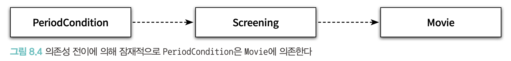

# chapter8. 의존성 관리하기

<aside>
💡 객체지향 설계란 의존성을 관리하는 것이고 객체가 변화를 받아들일 수 있게 의존성을 정리하는 기술이다.

</aside>

- 협력을 위해 `의존성`이 필요하지만 과도한 의존성은 수정에 대응하기 어렵다.
- 협력을 위해 필요한 의존성은 유지하고 변경을 방해하는 의존성을 제거하자

## 01. 의존성 이해하기

- 어떤 객체가 예정된 작업을 정상적으로 수행하기 위해 `다른 객체를 필요`로 하는 경우 두 객체 사이에 의존성이 존재한다

### 의존성 전이



- PeriodCondition이 Screening에 의존하면 Screening이 의존하는 대상에 대해서도 자동적으로 의존
- 다만, 모든 경우에 의존성이 전이되는 것이 아니다. 캡슐화의 정도에 따라 달라진다

### 런타임 의존성과 컴파일타임 의존성

- `런타임 의존성`(run-time dependency) : 애플리케이션이 실행되는 시점
- `컴파일타임 의존성`(compile-time dependency) : 작성된 코드를 컴파일하는 시점 & 코드 그 자체
    - 동적 타입 언어의 경우는 컴파일이 존재하지 않아서 코드 그 자체를 의미한다
- 런타임 의존성과 컴파일타임 의존성이 다를 수 있다
- 유연하고 재사용 가능한 코드를 설계하기 위해선 두 종류의 의존성을 서로 다르게 만들어야 한다

### 의존성 해결하기

- `Movie` ↔ `DiscountPolicy` : 컴파일 의존성
- `Movie` ↔ `PercentDiscountPolicy` OR `AmountDiscountPolicy` : 런타임 의존성
- 컴파일타임 의존성을 실행 컨텍스트에 맞는 적절한 런타임 의존성으로 교체

### 방법

- 객체를 생성하는 시점에 생성자를 통해 의존성 해결
- 객체 생성후 setter 메서드를 통해 의존성 해결
- 메서드 실행 시 인자를 이용해 의존성 해결

### 생성하는 시점에 생성자를 통해 의존성 해결

```java
Movie avatar = new Movie("아바타", Duration.ofMinutes(120), new AmountDiscountPolicy(..));

public class Movie {
	public Movie(String title, Duration runningTime, DiscountPolicy discountPolicy) {
		...
		this.discountPolicy = discountPolicy;
	}
}
```

### 객체 생성후 setter 메서드를 통해 의존성 해결

```java
Movie avatar = new Movie(...);
avatar.setDiscountPolicy(new AmountDsicotunPolicy());

public class Movie {
	public void setDiscountPolicy (DiscountPolicy discountPolicy) {
		this.discountPolicy = discountPolicy; 
	}
}
```

- 객체를 생성하고 의존 대상을 설정하기 전까지는 객체의 상태가 불완전함

### 메서드 실행 시 인자를 통해 의존성 해결

```java
public class Movie {
	public Money calculateMovieFee(Screening screening, DiscountPolicy discountPolicy) {
		return fee.minus(discountPolicy.calculateDiscountAmount(screening));	
	}
}
```

- 메서드가 실행하는 동안만 의존관계가 존재해도 무방할때
- 메서드가 실행될 때마다 의존 대상이 매번 달라질 때

## 02. 유연한 설계

### 의존성과 결합도

- 바람직한 의존성은 재사용성과 관련이 있다
- 재사용이 가능하도록 하는 방법은?
    - 알고 있는 정보의 양을 줄이자
        - 구체적인 계산 방법 + 할인 요금을 계산
        - ~~구체적인 계산 방법~~ + 할인 요금을 계산

### 추상화에 의존하라

- 구체 클래스 의존성
- 추상 클래스 의존성
- 인터페이스 의존성

<aside>
💡 의존하는 대상이 더 추상적일수록 결합도는 더 낮아진다

</aside>

### new는 해롭다

- 구체 클래스에 직접 의존하면 결합도가 높아진다
- 인스턴스를 생성하는 로직과 생성된 인스턴스를 사용하는 로직을 분리시키자

```java
public class Movie { 
	...
	private DiscountPolicy discountPolicy;

	public Movie(String title, Duration runningTime, Money fee, DiscountPolicy discountPolicy) { 
		...
		this.discountPolicy = discountPolicy; 
	}
}
```

- Movie 는 AmountDiscountPolicy의 인스턴스를 직접 생성하지 않는다
- 클라이언트에서 생성해서 넘겨줌
- 객체를 생성하는 책임을 객체 내부가 아니라 클라이언트로 옮기는 것부터 시작했다는 점을 기억하라

### 조합 가능한 행동

- 어떻게(how) 하는지를 장황하게 나열하지 않고도 객체들의 조합을 통해 `무엇(what)을 하는지`를 표현하는 것이 유연하고 재사용 가능한 설계의 객체