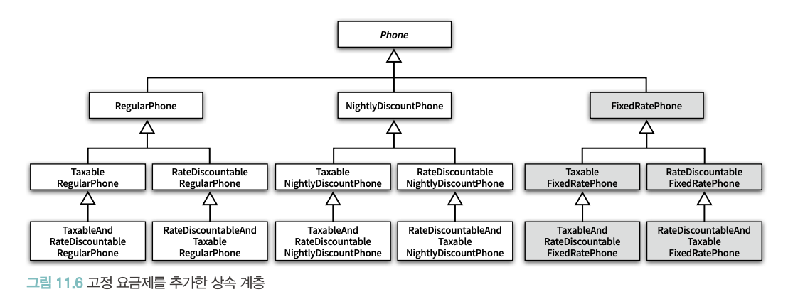

# chapter11. 합성과 유연한 설계

> 상속 관계는 `is-a` 관계라고 부르고 합성 관계는 `has-a` 관계라고 부른다
>
- 상속을 제대로 활용하기 위해서는 부모 클래스의 내부 구현에 대해 상세하게 알아야 함
- 자식 클래스와 부모 클래스 사이의 결합도가 높아짐
- 코드를 재사용할 수 있는 쉽고 간단한 방법일지는 몰라도 우아한 방법이라고 할 수는 없음

> 합성은 구현에 의존하지 않는다는 점에서 상속과 다르다
>
- 내부에 포함되는 객체의 구현이 아닌 퍼블릭 인터페이스에 의존한다
- 상속 관계는 클래스 사이의 `정적`인 관계
- 합성 관계는 객체 사이의 `동적`인 관계
- 코드 작성 시점에 결정한 상속 관계는 변경이 불가능하지만 합성 관계는 `실행시점에 동적으로 변경`할 수 있음

> 합성을 사용하면 클래스 사이의 높은 결합도를 객체 사이의 낮은 결합도록 대체
>

화이트박스

### 블랙박스 재사용(black-box reuse)

- 객체를 합성하려면 합성할 객체들의 인퍼테이스를 명확하게 정의해야만 한다
- 이런 스타일의 재사용을 블랙박스 재사용이라 함
- 객체의 내부는 공개되지 않고 인터페이스를 통해서만 재사용되기 때문

## 01. 상속을 합성으로 변경하기

### 상속으로 직면할 수 있는 세 가지 문제점

- 불필요한 인터페이스 상속 문제
- 메서드 오버라이딩의 오작용 문제
- 부모 클래스와 자식 클래스의 동시 수정 문제

### 상속을 합성으로 바꾸는 방법

- 자식 클래스에 선언된 상속 관계 제거
- 부모 클래스의 인스턴스를 자식 클래스의 인스턴스 변수로 선언

## 02. 상속으로 인한 조합의 폭발적인 증가

- 작은 기능들을 조합해서 더 큰 기능을 수행하는 객체를 만들어야 하는 경우
    - 하나의 기능을 추가하거나 수정하기 위해 불필요하게 많은 수의 클래스를 추가하거나 수정해야 함
    - 단일 상속만 지원하는 언어에서는 상속으로 인해 오히려 중복 코드의 양이 늘어남

### 기본 정책과 부가 정책 조합하기

- 일반 요금제 + 심야 할인 요금제
    - 새로운 요구사항 : 두 요금제에 부가 정책 추가
- `기본 정책`
    - 일반 요금제 / 심야 할인 요금제
    - 가입자의 한달 통화량을 기준으로 부과할 요금을 계산
- `부가 정책`
    - 세금 정책 / 기본 요금 할인 정책
    - 기본 정책에 선택적으로 추가할 수 있는 요금 방식

### 부가 정책 특성

- 기본 정책의 계산 결과에 적용된다
- 선택적으로 적용할 수 있다
- 조합 가능하다
- 부가 정책은 임의의 순서로 적용 가능하다

### 상속을 이용해서 기본 정책 구현하기

- Phone 추상 클래스를 루트로 삼는 기존의 상속 계층을 그대로 이용
- 일반 요금제를 구현하는 RegularPhone
- 심야 할인 요금제를 구현하는 NightlyDiscountPhone

### 기본 정책에 세금 정책 조합하기

- 가장 간단한 방법은 `RegularPhone` 클래스를 상속받은 `TaxableRegularPhone` 클래스 추가
- `TaxableRegularPhone` 클래스는 부모 클래스의 `calculateFee` 메서드를 오버라이딩한 후 super 호출을 통해 부모 클래스에게 `calculateFee` 메시지 전송
- 자식 클래스와 부모 클래스 사이의 결합도가 높아짐
    - 결합도 낮추는 방법 : 자식 클래스가 부모 클래스의 메서드를 호출하지 않도록 부모 클래스에 추상 메서드를 제공
    - 부모 클래스가 자신이 정의한 추상 메서드를 호출 → 자식 클래스가 이 메서드를 오버라이딩
        - Phone 클래스에 추가된 추상 메서드 `afterCalculated` 추가
    - 이 방법으로 Phone 을 상속받고 있던 `RegularPhone`, `NightlyDiscountPhone` 등 클래스에 수정이 들어가야됨

  ⇒ 부모 클래스에 추상 메서드를 추가하면 모든 자식 클래스들이 추상 메서드를 오버라이딩해야 하는 문제 발생

    - 문제 해결 : `afterCalculated` 메서드에 대한 기본 구현 제공

### 추상 메서드와 훅 메서드

- 메서드에 기본 구현을 제공 → 훅 메서드

### 기본 정책에 기본 요금 할인 정책 조합하기

- 기본 요금 할인 정책이란 매달 청구되는 요금에서 고정된 요금을 차감하는 부가 정책
- `RegularPhone` 을 상속받는 `RateDiscountableRegularPhone` 클래스 추가
- 심야 할인 요금제와 기본 요금 할인 정책을 조합하고 싶다면 `NightlyDiscountPhone` 을 상속받는 `RateDiscountableNightlyDiscountPhone` 클래스 추가

### 중복 코드의 덫에 걸리다

- 부가 정책은 자유롭게 조합할 수 있어야 하고 적용되는 순서 역시 임의로 결정할 수 있어야 함
- 세금 정책과 기본 요금 할인 정책을 함께 적용하는 것도 가능해야 함
- 세금 정책을 적용한 후에 기본 요금 할인 정책을 적용하거나
- 기본 요금 할인 정책을 적용한 후에 세금 정책을 적용하는 것도 가능해야 함
- 상속으로 해결하기
    - 일반 요금제의 계산 결과에 세금 정책을 조합한 후 기본 요금 할인 정책을 추가하고 싶다면,
        - `TaxableRegularPhone` 을 상속받는 새로운 자식 클래스인 `TaxableAndRateDiscountableRegularPhone` 추가
    - 표준 요금제에 기본 요금 할인 정책을 먼저 적용한 후 세금을 나중에 부과하고 싶다면 `RateDiscountableRegularPhone` 을 상속받는 `RateDiscountableAndTaxableRegularPhone` 클래스 추가
- 복잡성보다 더 큰 문제
    - 새로운 정책을 추가하기가 어렵다

### 클래스 폭발(class explosion) 조합의 폭발(combinational explosion)

- 자식 클래스가 부모 클래스의 구현에 강하게 결합되도록 강요하는 상속의 근본적인 한계 때문에 발생하는 문제

## 03. 합성 관계로 변경하기

- 합성은 컴파일타임 관계를 런타임 관계로 변경
- 합성은 조합을 구성하는 요소들을 개별 클래스로 구현한 후 실행 시점에 인스턴스를 조립하는 방법
- 코드를 이해하기 어려워지는 것 역시 사실이지만 설계는 변경과 유지보수를 위해 존재한다는 사실을 기억

### 기본 정책 합성하기

**RatePolicy**

- 핸드폰이라는 개념으로부터 `요금 계산 방법`이라는 개념을 분리해야 함
- 먼저 기본 정책과 부가 정책을 포괄하는 `RatePolicy` 인터페이스 추가
- RatePolicy 는 `Phone을 인자로 받아 계산된 요금을 반환`하는 calculateFee 오퍼레이션을 포함하는 간단한 인터페이스

**BasicRatePolicy**

- 기본 정책을 구성하는 일반 요금제와 심야 할인 요금제는 개별 요금을 계싼하는 방식을 제외한 전체 처리 로직이 거의 동일함
- 이런 중복 코드를 담을 추상 클래스 `BasicRatePolicy`를 추가

**RegularPolicy**

- 일반 요금제

**NightlyDiscountPolicy**

- 심야 할인 요금제

**Phone**

- `Phone` 내부에 `RatePolicy`에 대한 참조자가 포함돼 있다는 것에 주목
- Phone은 이 컴파일타임 의존성을 구체적인 런타임 의존성으로 대체하기 위해 **생성자**를 통해 `RatePolicy`의 인스턴스에 대한 의존성을 주입받음

### 부가 정책 적용하기

- 부가 정책은 `기본 정책에 대한 계산이 끝난 후에 적용`된다는 것
- 부가 정책은 `기본 정책이나 다른 부가 정책의 인스턴스를 참조`할 수 있어야 함
- 부가 정책의 인스턴스는 `어떤 종류의 정책과도 합성`할 수 있어야 함
- Phone 의 입장에서는 자신이 **기본 정책의 인스턴스에게 메시지를 전송**하고 있는지, **부가 정책의 인스턴스에게 메시지를 전송하고 있는지**를 몰라야 한다
- 부가 정책은 `RatePolicy` 인터페이스를 구현해야 하며, 내부에 또 다른 `RatePolicy` 인스턴스를 합성할 수 있어야 함

**AdditionalRatePolicy**

- Phone의 입장에서 AdditionalRatePolicy는 RatePolicy의 역할을 수행하기 때문에 RatePolicy의 인터페이스를 구현
- 다른 요금 정책과 조합될 수 있도록 RatePolicy 타입의 next 라는 이름을 가진 인스턴스 변수를 내부에 포함

### 객체 합성이 클래스 상속보다 더 좋은 방법이다

- 상속은 부모 클래스의 세부적인 구현에 자식 클래스를 강하게 결합 시키기 때문에 코드의 진화를 방해함

### 04. 믹스인

- 상속과 클래스를 기반으로 하는 재사용 방법을 사용하면 클래스의 확장과 수정을 일관성 있게 표현할 수 있는 추상화의 부족으로 `변경하기 어려운 코드`를 얻게 됨
- 구체적은 코드를 재사용하면서도 낮은 결합도를 유지할 수 있는 유일한 방법은 `재사용에 적합한 추상화`를 도입하는 것
- 믹스인은 객체를 생성할 때 `코드 일부를 클래스 안에 섞어 넣어 재사용`하는 기법
- 상속과의 차이
    - 상속의 진정한 목적은 자식 클래스를 부모 클래스와 동일한 개념적인 범주로 묶어 `is-a 관계`를 만들기 위한 것
    - 믹스인은 말 그대로 `코드를 다른 코드 안에 섞어 넣기` 위한 방법
- 코드를 다른 코드 안에 유연하게 섞어 넣을 수 있다면 믹스인이라고 부를 수 있다
- kotlin by delegate pattern

### 쌓을 수 있는 변경

- 전통적으로 믹스인은 특정한 클래스의 메서드를 재사용하고 기능을 확장하기 위해 사용돼 왔음
- 핸드폰 과금 시스템의 경우에는 BasicRatePolicy의 calculateFee 메서드의 기능을 확장하기 위해 믹스인을 사용
- 믹스인은 상속 계층 안에서 확장한 클래스보다 더 하위에 위치
- 믹스인은 대상 클래스의 자식 클래스처럼 사용될 용도로 만들어지는 것
- 따라서 믹스인을 추상 서브클래스(abstract subclass)