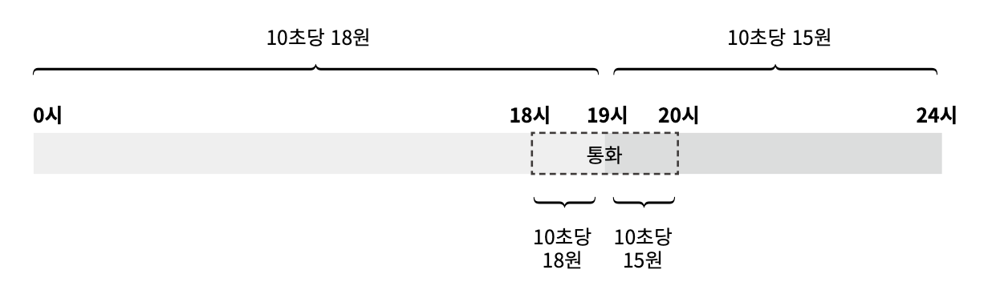
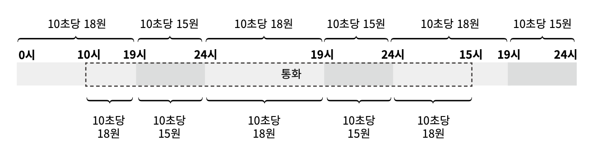
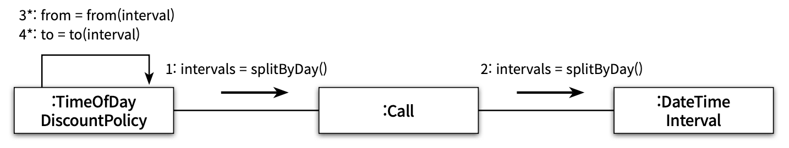
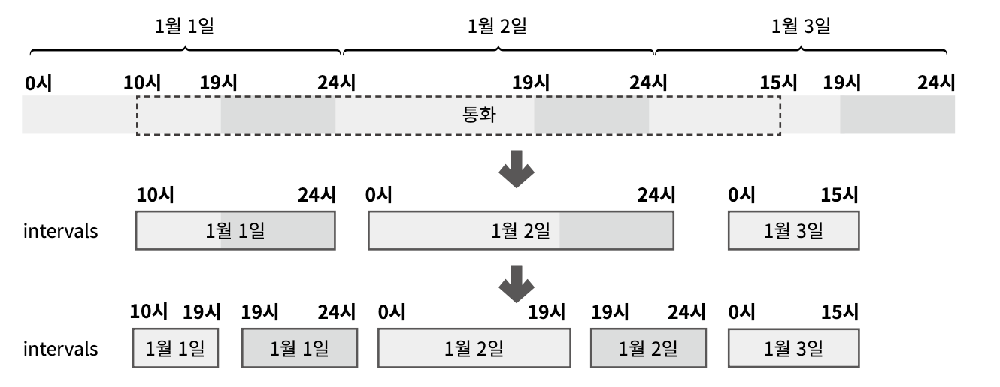
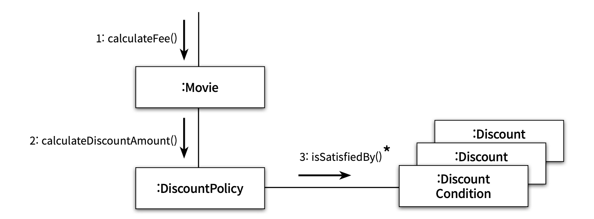
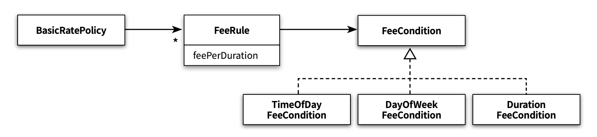
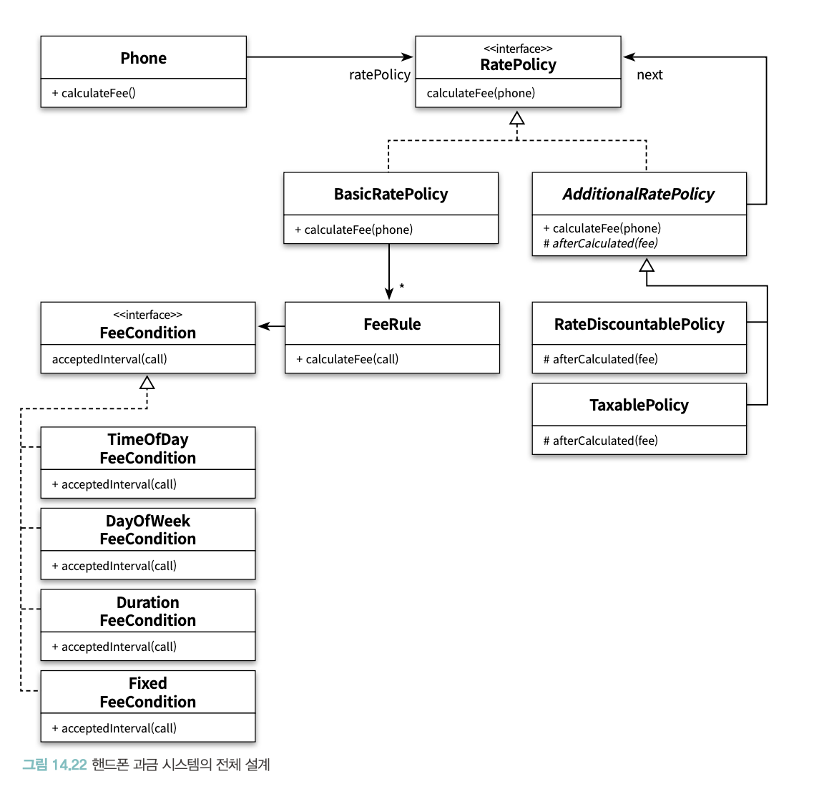

# chapter14. 일관성 있는 협력

- 잘 설계된 애플리케이션은 이해하기 쉽고, 수정이 용이하며, 재사용 가능한 협력의 모임
- 객체지향 설계의 목표는 적절한 책임을 수행하는 객체들의 협력을 기반으로
    - 결합도가 낮고 재사용 가능한 코드 구조를 창조하는 것

## 01. 핸드폰 과금 시스템 변경하기

### 고정요금 방식 구현하기

```java
public class FixedFeePolicy extends BasicRatePolicy {

    private Money amount;
    private Duration seconds;

    public FixedFeePolicy(Money amount, Duration seconds) {
        this.amount = amount;
        this.seconds = seconds;
    }

    @Override
    protected Money calculateCallFee(Call call) {
        return amount.times(call.getDuration().getSeconds() / seconds.getSeconds());
    }
}
```

- 기존의 일반요금제와 동일

### 시간대별 방식 구현하기

- 하루 24시간을 특정한 시간 구간으로 나눈 후 각 구간별로 서로 다른 요금을 부과하는 방식



- 0시부터 19시까지의 통화 = 10초당 18원
- 19시부터 24시까지의 통화 = 10초당 15원

**통화가 여러 날에 걸쳐서 이루어진다면?**



- 통화 구간을 분리 → 각 구간에 대해 개별적으로 계산된 요금 합하기
- 시작 **시간** + 종료 **시간** + 시작 **일자** + 종료 **일자**
- 시간대별 방식의 핵심 : 규칙에 따라 통화 시간을 분할하는 방법 결정하는 것

```java
public class DateTimeInterval {
    private LocalDateTime from;
    private LocalDateTime to;

    public static DateTimeInterval of(LocalDateTime from, LocalDateTime to) {
        return new DateTimeInterval(from, to)
    }

    public static DateTimeInterval toMidnight(LocalDateTime from) {
        return new DateTimeInterval(
                from,
                LocalDateTime.of(from.toLocalDate(), LocalTime.of(23, 59, 59, 999_999_999))
        );
    }

    public static DateTimeInterval fromMidnight(LocalDateTime to) {
        return new DateTimeInterval(
                LocalDateTime.of(to.toLocalDate(), LocalTime.of(0, 0)),
                to
        );
    }

    public static DateTimeInterval during(LocalDateTime date) {
        return new DateTimeInterval(
                LocalDateTime.of(date, LocalTime.of(0, 0)),
                LocalDateTime.of(date, LocalTime.of(23, 59, 59, 999_999_999))
        );
    }

    private DateTimeInterval(LocalDateTime from, LocalDateTime to) {
        this.from = from;
        this.to = to;
    }
    
    public Duration duration() {
        return Duration.between(from, to);
    }
    
    public LocalDateTime getFrom() {
        return from;
    }

    public LocalDateTime getTo() {
        return to;
    }
}
```

- 기간을 편하게 관리할 수 있는 `DateTimeInterval`
- 인스턴스 변수 : 시작 시간(`from`) 종료 시간(`to`)
- 객체 생성 : 정적 메서드 `of`, `toMidnight`, `fromMidnight`, `during`

```java
public class Call {
    private DateTimeInterval interval;

    public Call(LocalDateTime from, LocalDateTime to) {
        this.interval = DateTimeInterval.of(from, to);
    }

    public Duration getDuration() {
        return interval.duration();
    }
    
    public LocalDateTime getFrom() {
        return interval.getFrom();
    }

    public LocalDateTime getTo() {
        return interval.getTo();
    }
    
    public DateTimeInterval getInterval() {
        return interval;
    }
}
```

- 기간을 하나의 단위로 표현할 수 있는 DateTimeInterval 타입 사용
- from 과 to 를 Interval 이라는 하나의 인스턴스 변수로 묶음

**요금 계산 로직**

- 통화 기간을 일자별로 분리한다
- 일자별로 분리된 기간을 다시 시간대별 규칙에 따라 분리한 후 각 기간에 대해 요금을 계산한다

**통화 기간을 일자별로 분리한다**

- ‘통화 기간’ 정보 전문가 : `Call`
- ‘기간을 처리하는 방법’ 정보 전문가 : `DateTimeInterval`
- `Call` → 분할 요청 → `DateTimeInterval`

**시간대별로 분할한다**

- ‘시간대별 기준을 잘 알고 있는 요금 정책’ 정보 전문가 : `TimeOfDayDiscountPolicy`

### 전체 통화 시간 분할 작업



1. `TimeOfDayDiscountPolicy` → 일자별로 통화 기간 분리 요청 → `Call`
2. `Call` → 위임 → `DateTimeInterval`
3. `DateTimeInterval` : 기간을 일자 단위로 분할한 후 분할된 목록 반환 → `Call`
4. `Call` → 반환 → `TimeOfDayDiscountPolicy`
5. `TimeOfDayDiscountPolicy` : 루프를 돌리며 각 시간대별 기준에 맞는 시작시간, 종료시간 얻음



1. `DateTimeInterval` : ‘1월 1일 10시 ~ 24시’, ‘1월 2일 0시 ~ 24시’, ‘1월 3일 0시 ~ 15시’ → `Call`
2. `Call` → 반환 → `TimeOfDayDiscountPolicy`
3. `TimeOfDayDiscountPolicy` : ‘1월 1일 10시 ~ 19시’, ‘1월 1일 19시 ~ 24시’, ‘1월 2일 0시 ~ 19시’, ‘1월 2일 19시 ~ 24시’, ‘1월 3일 0시 ~ 15시’

```java
public class TimeOfDayDiscountPolicy extends chapter14.BasicRatePolicy {
    private List<LocalTime> starts = new ArrayList<>();
    private List<LocalTime> ends = new ArrayList<>();
    private List<Duration> durations = new ArrayList<>();
    private List<Money> amounts = new ArrayList<>();

    @Override
    protected Money calculateCallFee(Call call) {
        Money result = Money.ZERO;

        for (DateTimeInterval interval : call.splitByDay()) {
            for (int loop = 0; loop < starts.size(); loop++) {
                result.plus(amounts.get(loop).times(
                        Duration.between(from(interval, starts.get(loop)), to(interval, ends.get(loop)))
                                .getSeconds() / durations.get(loop).getSeconds()
                ));
            }
        }

        return result;
    }

    private LocalTime from(DateTimeInterval interval, LocalTime from) {
        return interval.getFrom().toLocalTime().isBefore(from) ?
                from :
                interval.getFrom().toLocalTime();
    }

    private LocalTime to(DateTimeInterval interval, LocalTime to) {
        return interval.getTo().toLocalTime().isAfter(to) ?
                to :
                interval.getTo().toLocalTime();
    }
}
```

- 시작 시간의 List
- 종료 시간의 List
- 단위 시간의 List
- 단위 요금의 List
- 같은 규칙에 포함된 요소들은 List 안에서 동일한 인덱스에 위치

```java
public class DateTimeInterval {
    private LocalDateTime from;
    private LocalDateTime to;

    public static DateTimeInterval of(LocalDateTime from, LocalDateTime to) {
        return new DateTimeInterval(from, to);
    }

    public static DateTimeInterval toMidnight(LocalDateTime from) {
        return new DateTimeInterval(
                from,
                LocalDateTime.of(from.toLocalDate(), LocalTime.of(23, 59, 59, 999_999_999))
        );
    }

    public static DateTimeInterval fromMidnight(LocalDateTime to) {
        return new DateTimeInterval(
                LocalDateTime.of(to.toLocalDate(), LocalTime.of(0, 0)),
                to
        );
    }

    public static DateTimeInterval during(LocalDate date) {
        return new DateTimeInterval(
                LocalDateTime.of(date, LocalTime.of(0, 0)),
                LocalDateTime.of(date, LocalTime.of(23, 59, 59, 999_999_999))
        );
    }

    private DateTimeInterval(LocalDateTime from, LocalDateTime to) {
        this.from = from;
        this.to = to;
    }

    public Duration duration() {
        return Duration.between(from, to);
    }

    public LocalDateTime getFrom() {
        return from;
    }

    public LocalDateTime getTo() {
        return to;
    }

    public List<DateTimeInterval> splitByDay() {
        if (days() > 0) {
            return splitByDay(days());
        }

        return Arrays.asList(this);
    }

    private long days() {
        return Duration.between(from.toLocalDate().atStartOfDay(), to.toLocalDate().atStartOfDay())
                .toDays();
    }

    private List<DateTimeInterval> splitByDay(long days) {
        List<DateTimeInterval> result = new ArrayList<>();
        addFirstDay(result);
        addMiddleDays(result, days);
        addLastDay(result);
        return result;
    }

    private void addFirstDay(List<DateTimeInterval> result) {
        result.add(DateTimeInterval.toMidnight(from));
    }

    private void addMiddleDays(List<DateTimeInterval> result, long days) {
        for (int i = 1; i < days; i++) {
            result.add(DateTimeInterval.during(from.toLocalDate().plusDays(i)));
        }
    }

    private void addLastDay(List<DateTimeInterval> result) {
        result.add(DateTimeInterval.fromMidnight(to));
    }
}
```

- `splitByDay()` : 통화 기간을 일자별로 분할해서 반환
- `days()` : 메서드는 from 과 to 사이에 포함된 날짜 수를 반환
- 만약 days 메서드의 반환값이 1보다 크다면(여러 날에 걸쳐 있는 경우) split 메서드를 호출해서 날짜 수만큼 분리
- 만약 days 메서드의 반환값이 1이라면 (하루 안의 기간이라면) 현재의 DateTimeInterval 인스턴스 그대로 반환

### 요일별 방식 구현하기

- 요일별로 요금을 차등 부과하는 방식
- 이 방식을 사용하면 월요일부터 금요일까지는 10초당 38원, 토요일과 일요일에는 10초당 19월 부과…
- 요일별로 요금 규칙을 다르게 설정
- 각 규칙은 요일의 목록, 단위 시간, 단위 요금으로 구성

```java
public class DayOfWeekDiscountRule {
    private List<DayOfWeek> dayOfWeeks = new ArrayList<>();
    private Duration duration = Duration.ZERO;
    private Money amount = Money.ZERO;

    public DayOfWeekDiscountRule(List<DayOfWeek> dayOfWeeks, Duration duration, Money amount) {
        this.dayOfWeeks = dayOfWeeks;
        this.duration = duration;
        this.amount = amount;
    }

    public Money calculate(DateTimeInterval interval) {
        if (dayOfWeeks.contains(interval.getFrom().getDayOfWeek())) {
            return amount.times(interval.duration().getSeconds() / duration.getSeconds());
        }

        return Money.ZERO;
    }
}
```

- 요일의 목록 dayOfWeeks
- 단위 시간 duration
- 단위 요금 amount
- calculate 메서드는 파라미터로 전달된 interval 이 요일 조건을 만족할 경우 단위 시간과 단위 요금을 이용해 통화 요금을 계산한다

```java
public class DayOfWeekDiscountPolicy extends chapter14.BasicRatePolicy {
    private List<DayOfWeekDiscountRule> rules = new ArrayList<>();

    public DayOfWeekDiscountPolicy(List<DayOfWeekDiscountRule> rules) {
        this.rules = rules;
    }

    @Override
    protected Money calculateCallFee(Call call) {
        Money result = Money.ZERO;
        for (DateTimeInterval interval : call.getInterval().splitByDay()) {
            for (DayOfWeekDiscountRule rule : rules) {
                result.plus(rule.calculate(interval));
            }
        }
        
        return result;
    }
}
```

- 요일별 방식 역시 통화 기간이 여러 날에 걸쳐 있을 수 있음
- 따라서 시간대별 방식과 동일하게 통화 기간을 날짜로 분리하고
- 분리된 통화 기간을 요일별로 설정된 요금 정책에 따라 계산

### 구간별 방식 구현하기

- 전체 통화 시간을 일정한 통화 시간에 따라 나누고 각 구간별로 요금을 차등 부과하는 방식
- 통화 구간을 초기 1분과 1분 이후로 나눈 후 초기 1분 동안은 10초당 50원… 그 후는 10초당 20원…

**일관성 없는 코드가 가지는 문제점**

- 코드를 이해하기 어렵다
- 대부분의 사람들은 유사한 요구사항 → 유사한 방식
    - but 요구사항이 서로 다른 방식으로 구현된다면? → 의심
- 개발자는 여러 가지 해결 방법 중 가장 적절한 요구사항 해결 방법을 찾아야 하는 부담감

**유사한 기능은 유사한 방법으로 구현해야 한다**

- 협력을 일관성 있게

```java
public class DurationDiscountRule extends FixedFeePolicy {
    private Duration from;
    private Duration to;
    
    public DurationDiscountRule(Duration from, Duration to, Money amount, Duration seconds) {
        super(amount, seconds);
        this.from = from;
        this.to = to;
    }

    public Money calculate(Call call) {
        if (call.getDuration().compareTo(to) > 0) {
            return Money.ZERO;
        }

        if (call.getDuration().compareTo(from) < 0) {
            return Money.ZERO;
        }
        
        // 부모 클래스의 calculateFee(phone)은 Phone 클래스를 파라미터로 받는다.
        // calculateFee(phone)을 재사용하기 위해
        // 데이터를 전달할 용도로 임시 Phone을 만든다
        Phone phone = new Phone(null);
        phone.call(new Call(call.getFrom().plus(from),
                call.getDuration().compareTo(to) > 0 ? call.getFrom().plus(to) : call.getTo()));

        return super.calculateFee(phone);
    }
}
```

- 요일별 방식과 다른 점 : 코드를 재사용하기 위해 `FixedFeePolicy` 클래스 상속
- DurationDiscountRule 클래스의 calculate 메서드 안에서 부모 클래스의 calculateFee 메서드를 호출

```java
public class DurationDiscountPolicy extends chapter14.BasicRatePolicy {
    private List<DurationDiscountRule> rules = new ArrayList<>();

    public DurationDiscountPolicy(List<DurationDiscountRule> rules) {
        this.rules = rules;
    }

    @Override
    protected Money calculateCallFee(Call call) {
        Money result = Money.ZERO;
        for (DurationDiscountRule rule : rules) {
            result.plus(rule.calculate(call));
        }
        return result;
    }
}
```

- `DurationDiscountPolicy` 클래스는 할인 요금을 정상적으로 계산하고
- 각 클래스는 하나의 책임만을 수행
- but **기본 정책을 구현하는 기존 클래스들과 일관성이 없음**

### 코드 재사용을 위한 상속은 해롭다

- `DurationDiscountRule` 은 상속을 잘못 사용한 경우다
    - `FixedFeePolicy`는 상속을 위해 설계된 클래스가 아님
    - `DurationDiscountRule`은 `FixedFeePolicy`의 서브타입이 아님
    - `DurationDiscountRule`이 `FixedFeePolicy`를 상속받는 이유는 `FixedFeePolicy` 클래스에 선언된 인스턴스 변수인 `amount`, `seconds`와 `calculateFee` 메서드를 재사용하기 위함임
    - 이해하기 어렵고 부자연스러움

## 02. 설계에 일관성 부여하기



- 조건 로직(if)을 객체 사이의 탐색 과정으로 변경한 객체지향 설계

### 클래스를 분리하기 위해 어떤 기준을 따르는 것이 좋을까?

- 변경의 이유와 주기
- 클래스는 명확히 단 하나의 이유에 의해서만 변경돼야 한다
- 클래스 안의 모든 코드는 함께 변경돼야 한다
- 단일 책임 원칙을 따르도록 클래스를 분리해야 한다

### 변하는 개념을 변하지 않는 개념으로부터 분리하라

- 기존 코드는 하나하나의 조건문이 개별적인 변경이었음
- 우리는 각 조건문을 개별적인 객체로 분리함
- 이 객체들과 일관성 있게 협력하기 위해 타입 계층을 구성함
- 그리고 이 타입 계층을 클라이언트로부터 분리하기 위해 역할을 도입
- 최종적으로 이 역할을 추상 클래스와 인터페이스로 구현
- 결과적으로 변하는 개념을 별도의 서브타입으로 분리한 후 서브타입들을 클라이언트로부터 캡슐화함

### 변하는 개념을 캡슐화해라

- Movie는 자신과 협력하는 객체의 구체적인 타입에 대해 알지 못한다
- 메시지 수신자의 타입은 Movie에 대해 완벽하게 캡슐화된다
- 핵심은 훌륭한 추상화를 찾아 추상화에 의존하도록 만드는 것
- 추상화에 대한 의존은 결합도를 낮추고 결과적으로 대체 가능한 역할로 구성된 협력을 설계할 수 있게 해준다
- 변경에 초점을 맞추고 캡슐화의 관점에서 세계를 바라보자! 그러면 일관성 있는 협력 패턴을 얻을 수 있다

### 캡슐화 다시 살펴보기

- 데이터 은닉은 모든 인스턴스 변수를 private 으로 선언하고 해당 클래스의 메서드만이 접근할 수 있어야 하는 것이 아니다
- 캡슐화란 변하는 어떤 것이든 감추는 것이다

**다양한 종류의 캡슐화**

- 데이터 캡슐화
    - Movie의 title
    - title의 가시성은 private 외부 접근 불가
    - 내부에 관리하는 데이터 캡슐화
- 메서드 캡슐화
    - DiscountPolicy의 getDiscountAmount
    - getDiscountAmount 메서드의 가시성은 Protected
    - 클래스의 내부 행동 캡슐화
- 객체 캡슐화
    - Movie의 DiscountPolicy 타입의 인스턴스 변수 discountPolicy
    - discountPolicy의 가시성은 private
    - Movie와 DiscountPolicy 사이의 관계를 변경해도 외부에 영향 미치지 않음
    - 객체 캡슐화 = 합성
- 서브타입 캡슐화
    - Movie는 DiscountPolicy에 대해선 알고 있지만
    - AmountDiscountPolicy와 PercentDiscountPolicy에 대해서는 알지 못함
    - 서브타입의 종류 캡슐화
    - 서브타입 캡슐화 = 다형성의 기반

## 03. 일관성 있는 기본 정책 구현하기

### 변경 분리하기

- 일관성 있는 협력을 만들기 위한 첫번째 단계 : 변하는 개념과 변하지 않는 개념 분리하기
- 핸드폰 과금 시스템
    - 변하는 부분
        - 적용조건
    - 변하지 않는 부분
        - 규칙
    - 변하지 않는 ‘규칙’으로부터 변하는 ‘적용조건’을 분리해야 한다

### 변경 캡슐화하기

- 협력을 일관성 있게 만들기 위해서는 변경을 캡슐화해서 파급효과를 줄여야 한다



- 개별 ‘규칙’을 구성하는 데 필요한 클래스들의 관계를 나타낸 것
- 하나의 기본 정책은 하나 이상의 ‘규칙’들로 구성
- 따라서 기본 정책을 표현하는 BasicRatePolicy는 FeeRule의 컬렉션을 포함
- FeeRule은 ‘규칙’을 구현하는 클래스
- ‘단위요금’은 FeeRule의 인스턴스 변수인 feePerDuration에 저장
- FeeCondition은 ‘적용조건’을 구현하는 인터페이스, 변하는 부분을 캡슐화하는 추상화
- FeeRule이 FeeCondition을 합성 관계로 연결하고 있다는 점에 주목
- FeeRule이 오직 FeeCondition에만 의존하고 있다는 점에 주목
- FeeRule은 FeeCondition의 어떤 서브타입도 알지 못함
- 따라서 변하는 FeeCondition의 서브타입은 변하지 않는 FeeRule로부터 캡슐화됨

### 추상화 수준에서 협력 패턴 구현하기

```java
public interface FeeCondition {
    List<DateTimeInterval> findTimeIntervals(Call call);
}
```

- 적용조건을 표현하는 추상화인 FeeCondition
- findTimeIntervals 오퍼레이션을 포함하는 인터페이스
    - 인자로 전달된 Call의 통화 기간 중에서 적용조건을 만족하는 기간을 구한 후 List에 담아 반환한다


```java
public class FeeRule {
    private FeeCondition feeCondition;
    private FeePerDuration feePerDuration;

    public FeeRule(FeeCondition feeCondition, FeePerDuration feePerDuration) {
        this.feeCondition = feeCondition;
        this.feePerDuration = feePerDuration;
    }

    public Money calculateFee(Call call) {
        return feeCondition.findTimeIntervals(call)
                .stream()
                .map(each -> feePerDuration.calculate(each))
                .reduce(Money.ZERO, (first, second) -> first.plus(second));
    }
}
```

- FeeRule은 ‘단위요금(feePerDuration)’과 ‘적용조건(feeCondition)’을 저장하는 두 개의 인스턴스 변수로 구성
- FeeRule.calculateFee 메서드는 FeeCondition에게 findTimeIntervals 메시지를 전송해서 조건을 만족하는 시간의 목록을 반환 받은 후 FeePerDuration의 값을 이용해 요금을 계산한다

```java
public class FeePerDuration {
    private Money fee;
    private Duration duration;

    public FeePerDuration(Money fee, Duration duration) {
        this.fee = fee;
        this.duration = duration;
    }

    public Money calculate(DateTimeInterval interval) {
        return fee.times(Math.ceil((double) interval.duration().toNanos() / duration.toNanos()));
    }
}
```

- FreePerDuration 클래스는 ‘단위 시간당 요금’ 이라는 개념을 표현
- 이 정보를 이용해 일정 기간 동안의 요금을 계산하는 calculate 메서드를 구현

```java
public class BasicRatePolicy implements RatePolicy {
    private List<FeeRule> feeRules = new ArrayList<>();

    public BasicRatePolicy(FeeRule ... feeRules) {
        this.feeRules = Arrays.asList(feeRules);
    }

    @Override
    public Money calculateFee(Phone phone) {
        return phone.getCalls()
                .stream()
                .map(call -> calculateFee(call))
                .reduce(Money.ZERO, (first, second) -> first.plus(second));
    }

    private Money calculate(Call call) {
        return feeRules
                .stream()
                .map(rule -> rule.calculateFee(call))
                .reduce(Money.ZERO, (first, second) -> first.plus(second));
    }
}
```

- BasicRatePolicy가 FeeRule의 컬렉션을 이용해 전체 통화 요금을 계산하도록 수정

### 정리

- 지금까지 구현한 클래스와 인터페이스는 모두 변하지 않는 추상화에 해당
- 이 요소들을 조합하면 전체적인 협력 구조가 완성됨
- 변하는 것과 변하지 않는 것을 분리하고 변하는 것을 캡슐화한 코드는
    - 오로지 변하지 않는 것과 추상화에 대한 의존성만으로도 전체적인 협력을 구현할 수 있다

### 구체적인 협력 구현하기

- 현재의 요금제가 시간대별 정책인지, 요일별 정책인지, 구간별 정책인지를 결정하는 기준은 FeeCondition을 대체하는 객체의 타입이 무엇인가에 달렸음
- FeeCondition 인터페이스를 실체화하는 클래스에 따라 기본 정책의 종류가 달라짐

**시간대별 정책**

```java
public class TimeOfDayFeeCondition implements FeeCondition {
    private LocalTime from;
    private LocalTime to;

    public TimeOfDayFeeCondition(LocalTime from, LocalTime to) {
        this.from = from;
        this.to = to;
    }

    @Override
    public List<DateTimeInterval> findTimeIntervals(Call call) {
        return call.getInterval().splitByDay()
                .stream()
                .filter(each -> from(each).isBefore(to(each)))
                .map(each -> DateTimeInterval.of(
                        LocalDateTime.of(each.getFrom().toLocalDate(), from(each)),
                        LocalDateTime.of(each.getTo().toLocalDate(), to(each))
                )).collect(Collectors.toList());
    }

    private LocalTime from(DateTimeInterval interval) {
        return interval.getFrom().toLocalTime().isBefore(from) ?
                from : interval.getFrom().toLocalTime();
    }

    private LocalTime to(DateTimeInterval interval) {
        return interval.getTo().toLocalTime().isAfter(to) ?
                to : interval.getTo().toLocalTime();
    }
}
```

- TimeOfDayFeeCondition의 인스턴스는 협력 안에서 FeeCondition을 대체할 수 있어ㅑㅇ 함
- 따라서 FeeCondition의 인터페이스를 구현하는 서브타입으로 만들어야 함
- 시간대별 정책의 적용조건은 “시작시간부터 종료시간까지” 패턴으로 구성
    - 시작시간(from)과 종료시간(to)을 인스턴스 변수로 포함
- findTimeIntervals 메서드는 인자로 전달된 Call의 통화 기간 중에서 TimeOfDayFeeCondition의 from과 to 사이에 포함되는 시간 구간을 반환

### 정리

- 변경을 캡슐화해서 협력을 일관성 있게 만들면 재사용성이 높아진다
- 새로운 기능을 추가하기 위해 오직 변하는 부분만 구현 → 원하는 기능을 쉽게 완성
- 코드의 재사용성 향상과 테스트해야 하는 코드의 양이 감소
- 새로운 정책을 추가한다면
    - FeeCondition 인터페이스를 구현하는 클래스를 구현하고
    - FeeRule과 연결하기만 하면 됨

**개념적 무결성**

- = 일관성
- 좋은 기능들이긴 하지만 서로 독립적이고 조화되지 못한 아이디어들을 담고 있는 시스템보다는 여러 가지 다양한 기능이나 갱신된 내용은 비록 빠졌더라도 하나로 통합된 일련의 설계 아이디어를 반영하는 시스템이 훨씬 좋다



### 패턴을 찾아라

- 애플리케이션에서 유사한 기능에 대한 변경이 지속적으로 발생한다면?
    - 변경을 캡슐화할 수 있는 적절한 추상화를 찾아라
    - 그리고 추상화에 변하지 않는 공통적인 책임을 할당하라!
- 현재의 구조가 변경을 캡슐화하기에 적합하지 않다면 코드를 수정하지 않고도 원하는 변경을 수용할 수 있도록 협력과 코드를 리팩터링하라